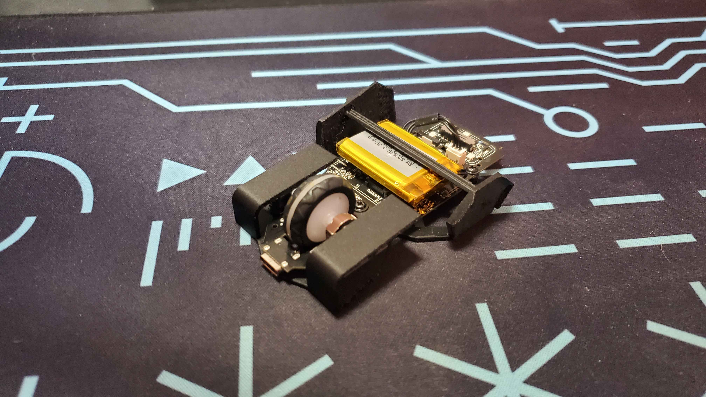
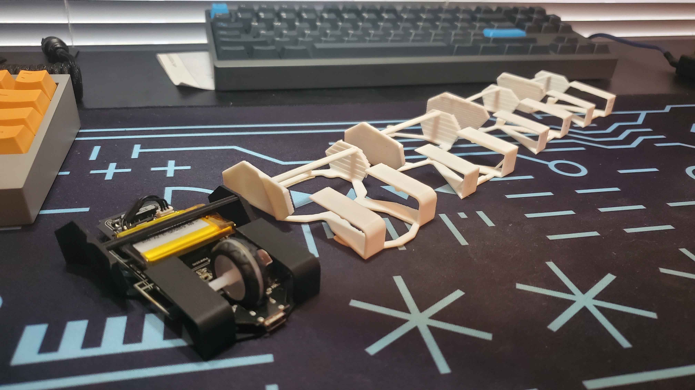
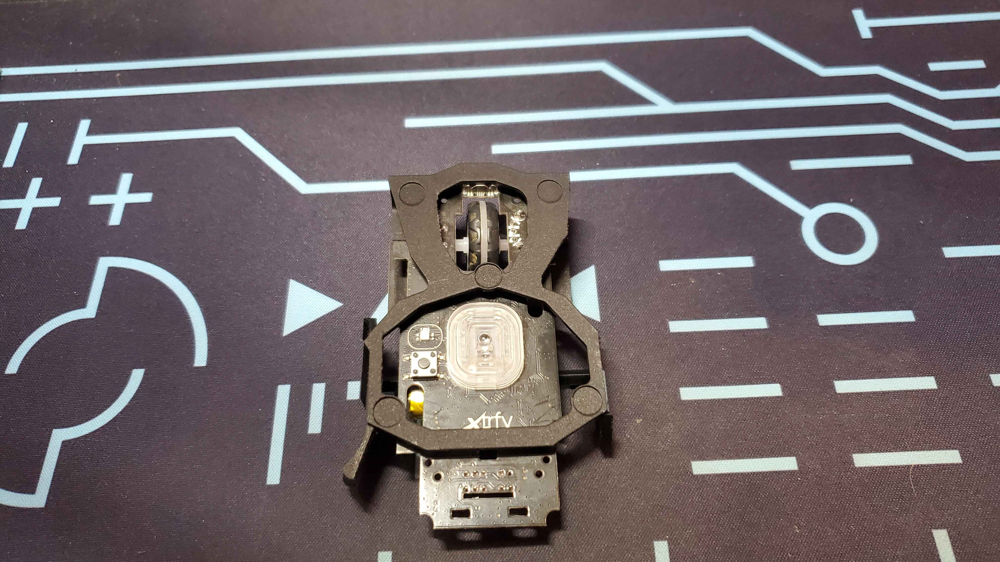

## My Start in 3-D Printing
Since coming to college, one of my good friends and roommate Caden has always been big into 3-D printing. Caden is an engineer, so his use of 3-D printing usually revolves around designing projects to build his engineering portfolio, with some examples being
a single plane 2 axis mechanical arm (for which he won the Student Innovation Center Maker Fair at Iowa State University) and a custom designed and built electric motor. Over the years I have seen these creations, but never had a direct interest in 3-D printing
myself until very recently.  
Not too long ago I got myself a new computer mouse, something I had been saving and waiting for for quite a while. However, I didn't want my old mouse to go to waste. What am I going to do with it? I don't plan on swapping between both, and I really have no use
for a spare since I trust the new mouse to last me a lifetime. So instead, I reached out to my roommate for his expertise in a new project; creating a custom gaming mouse.

## The inspiration
This concept is nothing new, and people have been designing custom gaming mice at home ever since additive manufacture became something that you could get at home, most often stemming from this same idea as me; "I got a knew mouse, what do I do with
 my old one that still works?" Scrolling [Thingiverse](https://www.thingiverse.com/search?q=g+pro+mouse&page=1) shows that there is no lack of mod kits for one of the most popular gaming mice on the market, but for my old mouse, 
 the [Xtryfy MZ1 Wireless](https://cherryxtrfy.com/mice/mz1-wireless/), there was nothing to be found. So, drawing inspiration from Australian Youtuber [Optimum Tech](https://www.youtube.com/watch?v=aHLzNnL81ms) and his custom designed "Zeromouse", I embarked on my 
 journey to learn CAD software and create my own mouse.

 ## Iterating My Design
 ### V1
 The start of designing the mouse was rough, but thanks to my roommate Caden I was able to quickly pick up the basic actions within the CAD software I was using (Fusion 360) and get started on a mouse. The first few hours consisted of Caden essentially reaching over my shoulders,
 grabbing the keyboard and mouse, and telling me what he was doing. After a bit I started getting the hang of it. Learning what different extrusion options meant, how and why I should make new planes, even how to get proper measurements off the PCB from my old mouse I was harvesting for this creation.
 Eventually I got to a point where I was relatively self sufficient, and he left to visit his girlfriend out of town for a few days. From that point I was on my own, and all I had in front of me was a rough outline of the PCB dimensions and some standoffs for screws to line up with.
 From here I designed the bottom frame, making sure to avoid the optical sensor and any buttons on the bottom of the mouse, and then started on all the various aspects that were necessary for a mouse. Side grips, triggers for the main buttons, extra nubs in various places to ensure things lined up.
 Then it was time to enter the big payoff; actually printing the first prototype. After exporting and slicing the file, I sent into to the printer, and after about an hour on my roommates top-quality 3-D printer we had out first print. I was excited, but while trying to remove the supports, 
 I noticed a ton of issues. Everything was snapping, go figure that 1 millimeter of plastic isn't strong. The side grips had an awful shape. Everything actually fell apart while removing supports. Noticing this, I immediately got to work on a V2.
 ### Version 2
 V2 of this project is where things really started to come together. I doubled the thickness of the base frame to hold everything together better. I increased the size of both side grips. I added a crossbar between the two side grips to add stability. I added a support for the front of the mouse
 to prevent it from sagging. It was perfect. I sent the new model to the printer and lo and behold, it was awful. My fingers didn't align with the grip shapes I had made in the slightest, the front mouse buttons collided with other components on the mouse and didn't actually work, and the placement
 of the crossbar was pointless, as the grips still flexed a ton. Learning this, I went back to the drawing board, implementing my changes. However this time I had something else to help me; I could hold this prototype and make adjustments this way. This ended up being invaluable to the creation of V3,
 as I could physically hold the mouse, see what I liked and didn't like, and then instantly make those changes. This led to an extremely fast creation of V3, starting the print only 45 minutes after V2 was finished printing.

 ### Version 3
 This is where the mouse began to finally take form. Learning lessons from the past two versions, this time I was able to make a mouse shell that actually functioned. After printing V3, I inserted my PCB and for the first time was able to actually click the mouse. I was ecstatic. After noticing that
 it seemed to work, I went to attach the battery and learned the first thing that needed changed; the battery wouldn't fit under the crossbar.  
 See, my plan had been to use the original foam adhesive to sandwich the battery between the PCB itself and the crossbar, but since the crossbar was too low it was an extremely tight fit. Eager to full test this version, I just stuffed the battery inside. While this did work (at the expense of extensive
 flexing on the crossbar) I do NOT recommend putting pressure on any form of battery, especially lithium polymer batteries like what are used in most computer mice. However, with this done I was able to test the mouse.  It sucked.  Both triggers for the mouse were at the same height,
  and since my wrist was rotated while holding the mouse, it felt as though the left button was lower which felt uncomfortable. Additionally, the mouse was impossible to move forward and backwards. While I had grips on the side, there was no angle to aid me in moving the mouse towards and away from me,
  meaning if I tried to aim up or down in a video game the mouse would feel slippery. While these all gave me new ideas for another variation, I was ultimately so excited to actually be playing games with a mouse I designed myself.

### Version 4
Version 4 is just about the end of this journey, and as of when I am writing this is the current physical version. In this version I raised the crossbar, added supports to the triggers to prevent unnecessary flex, and added flares to the side grips to keep my fingers in place.

At first I assumed this would be my final revision, to the point that I had previously written out this segment detailing exactly that. However, I knew that there was one more crucial change to drastically improve the mouse as a whole.  In gaming mice, it is generally better to have the mouses optical sensor closer to your fingertips,
so that it seems to move faster in accordance with your fingers. As of version 4, my mouse had the sensor placed just behind my thumb. This was far from optimal, and to change it would essentially require a complete redesign of the mouse from scratch, and so that is what I did. 

### Version 5 // Final
Only carrying over rough measurements and the grips that I had designed, I completely rebuilt the mouse. A new frame, new rounded triggers, a new placement of the support crossbar, and various other changes came together to create version 5. This change ended up being a phenomenal idea. By this point I had my roommate
back who taught me to add fillets, a curve on hard angles to decrease stress points, to create a stronger frame that appeared much more refined. After printing version 5 I was sure that this was the final revision, and I can confidently say now that for this journey version 5 is the final version.
It's comfortable, lightweight, and strong. Once I had decided that this was it, I talked with my roommate and we looked into al alternative printing strategy for this final model. Leading up to this point, we had been using a .4mm nozzle to print basic PLA plastic. This created a relatively shiny
product with layer lines barely visible to the eye and noticeable by touch. For this final revision, we changed to using a .2mm nozzle for a much higher resolution print (at the expense of taking nearly 6 times as long) and replacing the basic white PLA plastic with a carbon fiber reinforced PLA.
These two printing changes resulted in a mouse with lower weight, no noticeable layer lines, and a sleek matte black appearance (although this did take two attempts, as the first print failed).
[Link to the Bambu Lab MakerWorld file page](https://makerworld.com/en/models/807279#profileId-747978)

## What I learned
The number one takeaway from this project is a new respect for product designers, especially in the computer mouse industry. I would say that in every aspect aside from weight, I have created a worse mouse than the donor that I started with.
My creation is fragile, ugly, uncomfortable, and physically jagged with the only benefit being a cut from 62 grams down to 32 grams. Is a 30 gram weight saving in a mouse worth all the sacrifice? I would say no. My other mouse that I use on the daily is way more comfortable and easy to use, but I am still happy for the experience and glad that I made the custom mouse specifically for myself. 
I definitely see myself one day buying my own 3-D printer to create more iterations and likely a new fresh product.  
It also ended up being a nice bonding experience with my roommate. Asking him questions about CAD, showing him my successful and failed prototypes, and ultimately being able to share the excitement of a project completed with someone who knows so much about this was fullfilling.

# Gallery

