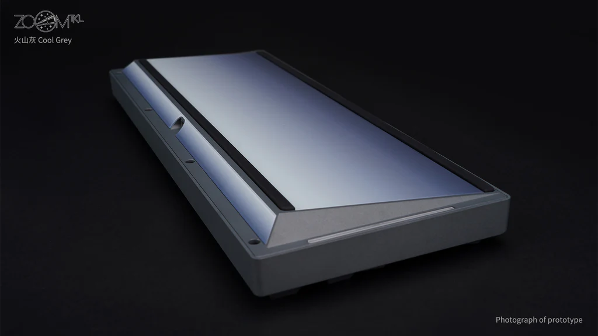
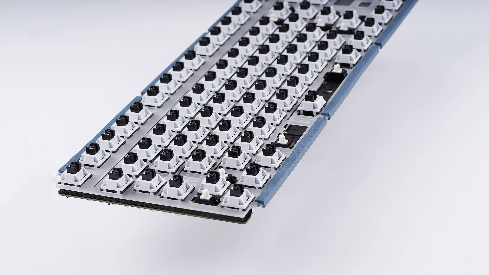

# The Meletrix / Wuque Studios' ZoomTKL
## My First Kit Board
Prior to this keyboard, every keyboard that I had built had been a combination of generic compatible parts making the ZoomTKL my first foray into a full pre-made kit. This main boils down to the time between builds, as this keyboard was purchased about two years after my previous build, during which time the keyboard industry had shifted towards this high-quality premade bundle of everything except keycaps and switches. After my experiences with this specific kit, I'm inclined that the kit keyboard concept worked pretty well. During purchasing, you are able to select a pretty decent variety of parts such as case color, external weight design/color, PCB type, and plate. This all allows for one kit to produce a wide range of feels and sounds, meaning each customer can make the board exactly how they want. Compared to the previous time I had made a board, the prepackaging of parts made everything work much better. Tighter tolerances all around, much better packaging, and all for what was essentially the same price as my previous keyboard amalgamations.

## What Sets This Board Apart
While there is the obvious difference to me that this is a kit board, there is still some big things that set this kit apart when it first released; namely the back panel/external weight and its foam gasket mounting mechanism

### The Rear Panel
This keyboard includes a very special rear mounted weight. While adding weight to keyboards is far from new (due to subject sound changes and the idea that people associate weight with quality) but these weights are usually screwed inside of the keyboard. While the ZoomTKL did include a internal stainless steel weight as an optional purchase, part of the base keyboard that customers had to choose an option for was the rear external weight. This weight was offered in a wide variety of designs, such as a carbon fiber panel, various finishes of steel (such as black PVD coated steel), and various colors of steel-back glass panels (such as the blue option I chose on my ZoomTKL). This immediately sets the board apart from others, as it gives a place for customization outside of just the standard keycaps. There can be someone with the same gray ZoomTKL as I have, but between the weight choice and other additional parts they each end up looking entirely individual. One gripe with the weight that I have seen across units of this keyboard is fitment issues with some of the weight panels. Since the rear weight is separated into three separate panels that are screw in, there are a large amount of edges that may not be machined properly, however my unit had no fitment issues when installing the rear weight.

### The Mounting Mechanism
One aspect of a keyboard that can have drastic changes on the feel is the way that the PCB/plate is mounted to the case. When I had first started building keyboards, the only common mounting mechanism was tray mount, where the PCB/plate is screw directly into the case. This creates a very solid and secure mount, which can make the keyboard feel very solid and well made. However, I found that after hours of use (namely while gaming) this hard mount style caused pain in the tips of my fingers, since I usually tend to type by bottoming out my keys leading to every keystroke being like slamming my fingertips against a block of aluminum. Once I saw that the ZoomTKL included a gasket mount (which was usually reserved for the highest quality/most expensive keyboards, like Wuque Studios' own PromiseTKL) I was sold. Sure other keyboards around this time were starting to adopt this mounting style, this was the first keyboard with it where the whole package had me interested. The benefit of this gasket mounting system is that it allows for a bit of flex within the keyboard. When pressing against the board as a whole, the foam gasket give a bit, meaning that quick hard presses (like what I do whenever typing) would have a bit of cushion on the end.

## My Overall thoughts
One thing that I have chose to omit from this review is anything pertaining to the shipping/purchasing of this and other boards. This mostly is due to the wide range of experiences one can have, since the ZoomTKL is designed and built in China and then imported to the U.S. by a separate company. While my shipment went fine through KeebsForAll, I have heard of others having significantly worse experiences even from the same vendor.

Keeping that aside, my overall thoughts on this board are extremely positive. After using it for about 2.5 years as of writing this, the keyboard has held up perfectly in the long run. I have never once had to do any sort of troubleshooting or maintenance, not even re-lubing the stock stabilizers. This has been by far my favorite keyboard to date. The weight feels sturdy, the mounting mechanism makes the board comfortable for long gaming sessions, and the sounds that it creates are impeccable. Overall I would absolutely consider purchasing a Meletrix/Wuque Studios board a second time in the future, and considering that I have seen them experiment with a hall effect board using their Zoom75 as a base then purchasing another board from them may occur sooner rather than later.